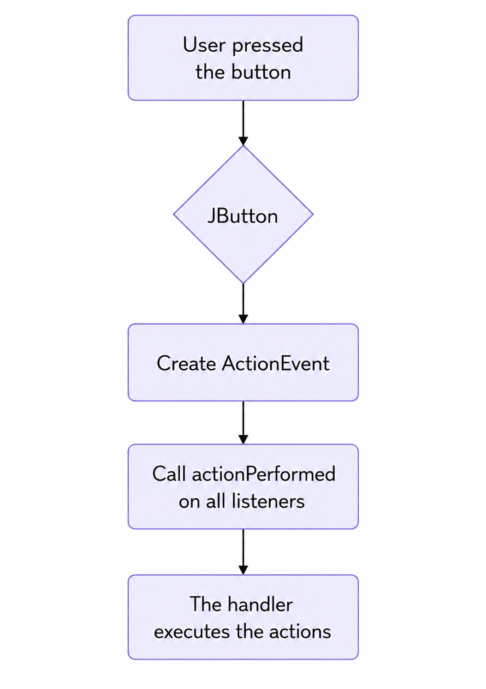

## Events in Swing and AWT: Basics, Examples.

### 1. A Very Brief Introduction to Swing and AWT

If Java were a car, Swing and AWT would be its dashboard and steering wheel. AWT (Abstract Window Toolkit) is the original library for creating windowed applications in Java. It uses native OS controls, so it looks different on Windows, Linux, and Mac.

Swing is a more modern superset of AWT, written entirely in Java. Swing is prettier, more flexible, supports a ton of additional features, and looks the same on all platforms (well, almost). In both cases, all interface elements (buttons, text fields, checkboxes, etc.) support events.

In this lecture, we'll use Swing: it's easier for beginners and is more commonly used in tutorials. Let's explore how event handling works using the most common example—reacting to a button press.

#### Creating a Button

In Swing, a button is created like this:

```java
JButton button = new JButton("Press me!");
```

Here, "Press me!" is the button's caption.

#### Adding a Listener

To respond to a button press, you need to "subscribe" the listener to the event:

```java
button.addActionListener(new MyActionListener());
```

But what is this MyActionListener? It's a class that implements the ActionListener interface:

```java
import java.awt.event.ActionEvent;
import java.awt.event.ActionListener;

public class MyActionListener implements ActionListener {
    @Override
    public void actionPerformed(ActionEvent e) {
        System.out.println("The button was pressed!");
    }
}
```

When the user clicks the button, Swing calls the actionPerformed method on all listeners registered via addActionListener.

#### Complete example: a simple window with a button

Let's put it all together and create a working application:

```java
import javax.swing.*;
import java.awt.event.*;

public class SimpleButtonApp {
    public static void main(String[] args) {
        JFrame frame = new JFrame("Event example");
        JButton button = new JButton("Click me!");
        
        // Add a listener to the button
        button.addActionListener(new ActionListener() {
            @Override
            public void actionPerformed(ActionEvent e) {
                System.out.println("The button was pressed!");
                JOptionPane.showMessageDialog(frame, "Hurray! The button was pressed!");
            }
        });
        
        frame.setDefaultCloseOperation(JFrame.EXIT_ON_CLOSE);
        frame.getContentPane().add(button);
        frame.setSize(300, 200);
        frame.setVisible(true);
    }
}
```

**What's happening here:**

- Create a window (JFrame).
- Create a button (JButton).
- Add a listener (anonymous class to avoid creating separate files).
- Within actionPerformed, we display a message in the console and a popup window (JOptionPane).
- Add a button to the window and display the window to the user.

**Try it yourself** copy this code, run it, and click the button!

- `frame.setDefaultCloseOperation(JFrame.EXIT_ON_CLOSE);`

Sets the window's behavior when clicking the cross ❌.

`JFrame.EXIT_ON_CLOSE` - "Close the window and completely terminate the program."

- `frame.getContentPane().add(button);`

Adds a button to the window.

`JFrame` has a special area for components—`ContentPane` (the content container).

This area contains:

- buttons
- text fields
- panels
- images, etc.

This line says:

> "Place a button inside the window."

- `frame.setSize(300, 200);`

Sets the window size.

- `frame.setVisible(true);`

Makes the window visible on the screen.

Before this line, the window exists only in program memory.

After this line, the user sees the GUI.

---

### 2. Anonymous Classes and Lambda Expressions

In modern Java code, writing separate classes for a single handler is like driving a tank to buy bread. It's much more convenient to use **anonymous classes** or **lambda expressions**.

#### Anonymous Class

We've already seen this approach above:

```java
button.addActionListener(new ActionListener() {
    @Override
    public void actionPerformed(ActionEvent e) {
        // handling code
    }
});
```

Here, the class is declared directly, without a name.

#### Lambda Expression (Java 8+)

If the listener interface is functional (meaning it contains only one abstract method), you can use a lambda:

```java
button.addActionListener(e -> {
    System.out.println("Button pressed via lambda!");
});
```

Or even shorter, if the body is a single line:

```java
button.addActionListener(e -> System.out.println("Lambda: Button pressed!"));
```

This not only shortens the code but also makes it more readable. **Fact for the curious:** the ActionListener interface is functional because it has only one method, actionPerformed.

---

### 3. Other Event Types

The world isn't limited to buttons! In Swing and AWT, almost every interface element supports its own events. Here are the most popular ones:

#### Mouse Events: MouseListener and MouseAdapter

If you want to respond to mouse clicks, use MouseListener:

```java
button.addMouseListener(new MouseListener() {
    @Override
    public void mouseClicked(MouseEvent e) {
        System.out.println("Mouse click on the button!");
    }
    // The remaining methods can be left empty
    //👉 The moment the finger is pressed, the finger has not yet been released.
    @Override public void mousePressed(MouseEvent e) {}
    
    //👉 The click has ended.
    @Override public void mouseReleased(MouseEvent e) {}
    
    //👉 For example, the mouse hovers over the button.
    @Override public void mouseEntered(MouseEvent e) {}
    
    //👉 The mouse has left the button
    @Override public void mouseExited(MouseEvent e) {}
});
```

Writing five empty methods for the sake of a single handler isn't very convenient. That's what MouseAdapter is for:

```java
button.addMouseListener(new MouseAdapter() {
    @Override
    public void mouseClicked(MouseEvent e) {
        System.out.println("Mouse click on button (via adapter)!");
    }
});
```

MouseAdapter implements all the interface methods, and you override only the ones you need.

#### Keyboard Events: KeyListener/KeyAdapter

If you need to catch key presses:

```java
button.addKeyListener(new KeyAdapter() {
    @Override
    public void keyPressed(KeyEvent e) {
        System.out.println("Key pressed: " + e.getKeyChar());
    }
});
```

#### Text Change Events: DocumentListener

For text fields (JTextField, JTextArea), there are special listeners:

```java
JTextField textField = new JTextField();
textField.getDocument().addDocumentListener(new DocumentListener() {
    @Override
    public void insertUpdate(DocumentEvent e) {
        System.out.println("Text changed: " + textField.getText());
    }
    @Override public void removeUpdate(DocumentEvent e) {}
    @Override public void changedUpdate(DocumentEvent e) {}
});
```

By the way, most events have adapters to avoid writing empty methods.

---

### 4. Practice: Mini-example with a window and a button

Let's make a simple GUI application: a window with a button that, when clicked, increments a counter and displays a message.

#### Example: Click counter

```java
import javax.swing.*;
import java.awt.*;
import java.awt.event.*;

public class ClickCounterApp {
    public static void main(String[] args) {
        JFrame frame = new JFrame("Click Counter");
        JButton button = new JButton("Click Me!");
        JLabel label = new JLabel("Clicks: 0");
        // Click counter (must be final or effectively final)
        final int[] count = {0};
        
        button.addActionListener(e -> {
            count[0]++;
            label.setText("Clicks: " + count[0]);
        });
        
        frame.setLayout(new FlowLayout());
        frame.add(button);
        frame.add(label);
        
        frame.setDefaultCloseOperation(JFrame.EXIT_ON_CLOSE);
        frame.setSize(250, 100);
        frame.setVisible(true);
    }
}
```

**Explanation:**

- We create a window, a button, and a label to display the counter.
- We use a single-element array (final int[] count = {0};) to bypass the lambda limitation on final/effectively final variables.
- Each time the button is clicked, we increment the counter and update the label's text.

**Practice idea:** Try changing the button's color every fifth click!

---

### 5. How the event model works internally

Let's take a quick look under the hood. When you call:

```java
button.addActionListener(listener);
```

the button (a JButton object) adds your listener to the internal list. When the user clicks a button, the following happens internally:

1. The button creates an event object (ActionEvent).
2. The button iterates through the list of listeners and calls the actionPerformed method on each one.
3. Your handler performs the desired action (for example, updating the label).

**Key thing to remember:** Each event can have any number of listeners—you can add multiple handlers for a single button, and they will be called one after the other.

---

### 6. Visual Diagram: Event Handling



---

### 7. Common Mistakes When Working with Events in Swing and AWT

**Error №1: Forgot to register a listener.** The button doesn't respond to clicks because you forgot to call addActionListener.

**Error №2: Heavy work in a handler.** If you're running a long loop or downloading something from the internet in an event handler, the UI will freeze. For long-running tasks, use separate threads or SwingWorker.

**Error №3: Trying to modify a variable from a lambda without final/effectively final.** Only final or "effectively final" variables can be used inside a lambda. For counters, use arrays or special classes (AtomicInteger, if you're feeling extra fancy).

**Error №4: Forgetting to remove a listener.** If you remove a component without removing the listener, a memory leak may occur. Unsubscribe when the component is no longer needed.

**Error №5: Not all interface methods are implemented.** If you implement, for example, MouseListener directly, don't forget to implement all the methods! It's better to use adapters (MouseAdapter, KeyAdapter).
